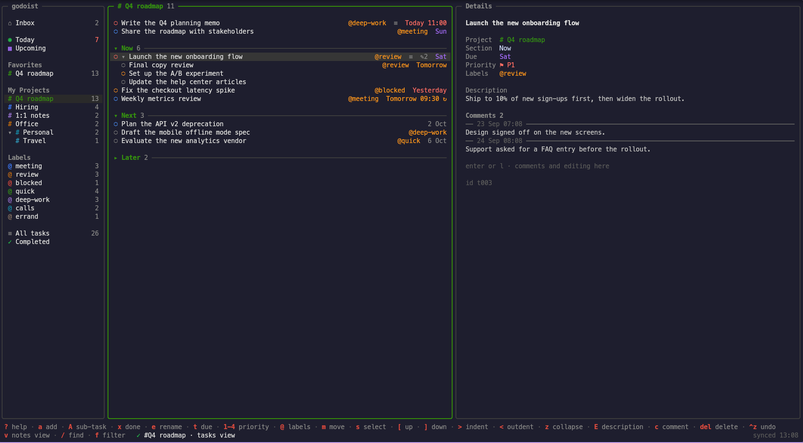

# godoist

godoist is a terminal program for [Todoist](https://todoist.com). It has a text user interface (TUI) with three panes and a command-line interface (CLI) for scripts. It is written in Go.

> This software was developed with the assistance of a LLM.



## Features

- Three panes: sidebar, task list, and details.
- Project colors from the Todoist palette. Light and dark terminal themes.
- Inbox, Today, Upcoming, Favorites, the project tree, labels, All tasks, and Completed, with task counts.
- Quick add with Todoist natural-language parsing: dates, `#project`, `/section`, `@label`, `p1`–`p4`.
- A date dialog with a text field, a month calendar, and a time field.
- Sub-tasks, manual order, priorities, labels, moves, comments, descriptions, sections, and projects.
- Collapse and expand of sections, sub-tasks, and sub-projects.
- Multi-select with bulk actions.
- Notebook view per project, with a markdown reader and an inline markdown editor.
- Todoist filter queries and a find in the current view.
- Mouse support: click, double-click, right-click menus, drag to move, and the wheel.
- A local cache. The program starts from the cache and syncs in the background.
- CLI commands with aligned columns, TSV, or JSON output.

## Requirements

- Go 1.27 or later, to build the program.
- A Todoist account and its API token.
- A terminal with true color and mouse support. Most modern terminals have both.

## Installation

Install the latest version with Go:

```sh
go install github.com/biomassa/godoist/cmd/godoist@latest
```

Go puts the binary in `$(go env GOPATH)/bin`. Make sure that this directory is in your `PATH`.

To build from the source:

```sh
git clone https://github.com/biomassa/godoist.git
cd godoist
go build -o godoist ./cmd/godoist
```

## Configuration

godoist needs your Todoist API token. Get it in Todoist: **Settings → Integrations → Developer**.

Give the token to godoist in one of these two ways:

1. Set the environment variable:

   ```sh
   export TODOIST_TOKEN=your-token
   ```

2. Save the token in the config file:

   ```sh
   godoist login
   ```

   This command asks for the token, makes sure that it works, and writes it to `~/.config/godoist/config.toml` with owner-only permissions.

The environment variable has priority over the config file.

godoist writes these files:

| File | Content |
|---|---|
| `~/.config/godoist/config.toml` | The API token (after `godoist login`). |
| `~/.cache/godoist/sync.json` | The local copy of your account (owner-only permissions). |
| `~/.local/state/godoist/state.toml` | The view mode of each project (tasks or notebook). |

## TUI

Start the TUI:

```sh
godoist
```

Push `?` to see all keys. The first bottom line shows the keys for the pane that has the focus. You can click a key there to run it. The second bottom line shows the last operation and the sync state.

### Main keys

| Key | Action |
|---|---|
| `tab`, `h` / `l` | Go to the next or previous pane. |
| `j` / `k`, `g` / `G` | Move down or up, go to the top or the bottom. |
| `enter` | Open the project, or open the details. |
| `a` | Add a task. Todoist parses the text. |
| `x` or `space` | Complete the task. `ctrl+z` undoes the last completion of a one-time task. |
| `e` | Rename the task. Todoist parses dates, `#project`, `@label`, and `p1`–`p4` in the text. |
| `E` | Edit the description. `ctrl+s` saves, `ctrl+e` opens `$EDITOR`. |
| `t` | Open the date dialog. |
| `1`–`4` | Set the priority. |
| `@` | Select labels. |
| `m` | Move the task to a project or a section. |
| `c` | Add a comment. |
| `A` | Add a sub-task to the task under the cursor. |
| `>` / `<` | Indent the task under the task above it, or outdent it one level. |
| `[` / `]` | Move the task up or down. At the edge of a section, the task goes into the next section. |
| `z` | Collapse or expand the sub-tasks. On a section header, collapse or expand the section. |
| `s` / `S` | Select the task, or select all tasks from the last selected task to the cursor. |
| `Delete` / `Backspace` | Delete the task. godoist asks first, because a deletion cannot be undone. |
| `v` | Change the project between task view and notebook view. |
| `/` | Find in the current view. |
| `f` | Run a Todoist filter query. Plain words search the task names. |
| `esc` | Clear the find or the filter. |
| `r` | Sync now. |
| `q` | Quit. godoist waits until all changes are saved. |

### Notebook view

Push `v` in a project to show it as a notebook. The right pane shows the note under the cursor as formatted markdown: headings as colored bars (red, yellow, green, blue, orange, and purple for levels 1 to 6), lists, `☐` / `☑` checkboxes, links (terminal hyperlinks), and code with syntax colors.

- In a note with checkboxes, `tab` and `shift+tab` move between the checkboxes, and `space` or a click changes a checkbox.
- To edit the note, push `enter` in the reader, push `E`, or double-click the text. The inline editor opens in the same pane. The editor shows the markdown source with styles. It saves by itself one second after you stop typing, and when you leave it with `esc`. The pane title shows `saved`, `saving…`, or `unsaved`.
- Editor keys: `ctrl+b` bold, `ctrl+i` italic, `ctrl+k` link, `ctrl+t` checkbox, `ctrl+z` / `ctrl+y` undo and redo, `alt+←` / `alt+→` word moves, `alt+backspace` deletes a word. `enter` on a list item starts the next item, and `enter` on an empty item ends the list.
- `ctrl+f` opens a find box at the top of the editor, with a replace field and the option **match case**. All matches are highlighted. `enter` goes to the next match and `shift+enter` to the previous match. `ctrl+r` replaces the current match and `ctrl+a` replaces all matches. They use the replace field as it is, so an empty field removes the matches (for example, all `**`). `tab` moves between the fields, `space` changes **match case**, and `esc` closes the box.

### Date dialog

The `t` key opens a dialog with three parts: a text field, a month calendar, and a time field.

1. Type a date in the text field, for example `fri 9am` or `every mon`. Type `no date` to remove the date.
2. Push `tab` to go to the calendar. Todoist parses the changed text one time, and the calendar shows the result.
3. In the calendar, use the arrow keys, `PgUp` / `PgDn`, `Home`, or the quick picks `1`–`5`.
4. Push `enter`. godoist saves the input that you changed last.

For a recurring task, a date from the calendar asks a question. Push `o` to move only this occurrence and keep the repeat. Push `r` to replace the repeat with the date.

### Projects

These keys work in the sidebar, with the cursor on a project:

| Key | Action |
|---|---|
| `A` | Add a project. Type the name, then select a color. The color picker can make the new project a sub-project of the project under the cursor. |
| `e` | Rename the project. |
| `C` | Change the color. |
| `*` | Add the project to Favorites, or remove it. |
| `[` / `]` | Move the project up or down among its siblings. |
| `z` | Collapse or expand the sub-projects. |
| `Delete` / `Backspace` | Delete or archive the project. A dialog asks which. |

You cannot change the Inbox. The Todoist free plan limits the number of projects. If Todoist refuses a new project, godoist shows the message from Todoist.

### Multi-select

Push `s` to select a task, or `S` to select a range. `ctrl`+click and `shift`+click also select. The title shows the number of selected tasks. With tasks selected, these keys act on all of them: `x`, `t`, `1`–`4`, `m`, `@`, and `Delete`. The selection stays after a change, so you can do more changes. `esc` clears the selection. One `ctrl+z` opens again all one-time tasks of a bulk completion.

In the label picker for several tasks, `[x]` shows a label that all tasks have, `[~]` a label that some tasks have, and `[ ]` a label that no task has. `space` changes the state. godoist changes only the labels that you changed.

### Labels

The **Labels** group in the sidebar shows your labels. Select a label to see its tasks, grouped by project. These keys work with the cursor on a label:

| Key | Action |
|---|---|
| `A` | Add a label. |
| `e` | Rename the label. Its tasks get the new name. |
| `C` | Change the color. |
| `*` | Mark the label as a favorite, or remove the mark. |
| `[` / `]` | Move the label up or down. |
| `Delete` / `Backspace` | Delete the label. The label goes away from its tasks, and the tasks stay. |

### Completed

The **Completed** item shows the tasks that you completed in the last 30 days, grouped by project. Push `x` to open a task again.

### Sub-tasks in Today, Upcoming, All tasks, labels, and filters

These views show sub-tasks under their parent tasks. A task with sub-tasks is collapsed at first. Push `z`, or click `▸`, to expand it. If only a sub-task belongs to the view (for example, only the sub-task is due today), the parent comes into the view in gray and is expanded. A parent shows one time, in the group of its earliest date. Each view keeps its own expanded tasks in `~/.local/state/godoist/state.toml`.

### All tasks

The **All tasks** item shows all tasks, grouped by project. In each project, the tasks with a due date come first, sorted by the date. In this view, `[` and `]` move only tasks without a due date.

### Confirmations

A deletion opens a dialog with buttons. The action button is selected when the dialog opens. Use the arrow keys, `tab`, or `h` / `l` to select a button, then push `enter`. You can also push the key of a button, or click it. `esc` closes the dialog.

### Sections

These keys work in a project:

| Key | Action |
|---|---|
| `A` | Add a section after the section under the cursor. |
| `e` | Rename the section under the cursor. |
| `[` / `]` | Move the section up or down. |
| `z` | Collapse or expand the section. |
| `Delete` / `Backspace` | Delete the section and its tasks. godoist asks first. |

### Mouse

- Click to select. Click the `○` circle to complete a task.
- Double-click a task to rename it.
- Right-click a task, a section header, a sidebar project, or a label to open a menu.
- Click a `▾` or `▸` marker to collapse or expand.
- `ctrl`+click selects a task, and `shift`+click selects a range.
- Drag a task to a sidebar project or a section header to move it.
- Use the wheel to scroll.

To select text in the terminal, hold `Shift` while you drag.

## CLI

Use the CLI in scripts. On a terminal, the output has aligned columns. In a pipe, the output is TSV. Add `--json` to get JSON.

| Command | Action |
|---|---|
| `godoist ls` | List the active tasks. |
| `godoist ls -p <project>` | List the tasks of one project. |
| `godoist ls -f "<filter>"` | List the tasks that match a Todoist filter. |
| `godoist add "<text>"` | Add a task with natural-language parsing. It prints the task ID. |
| `godoist add -p <project> "<text>"` | Add a task to a project. |
| `godoist done <id>...` | Complete tasks. |
| `godoist reopen <id>...` | Open completed tasks again. |
| `godoist rm <id>...` | Delete tasks. |
| `godoist projects` | List the projects. |
| `godoist login` | Save the API token. |

Examples:

```sh
godoist ls -f "today | overdue"
godoist add "Buy cables tomorrow 10am #work p2 @errand"
godoist ls -f "today" --json | jq -r '.[].content'
godoist ls -p work | cut -f1 | xargs godoist done
```

## Sync

godoist keeps a local copy of your account and uses the Todoist Sync API. It syncs:

- when it starts,
- after each change,
- every 60 seconds,
- when the terminal gets the focus,
- when you push `r`.

Each change goes to Todoist at once. godoist does not keep changes that only exist on your computer.

## Changes

See [CHANGELOG.md](CHANGELOG.md).
