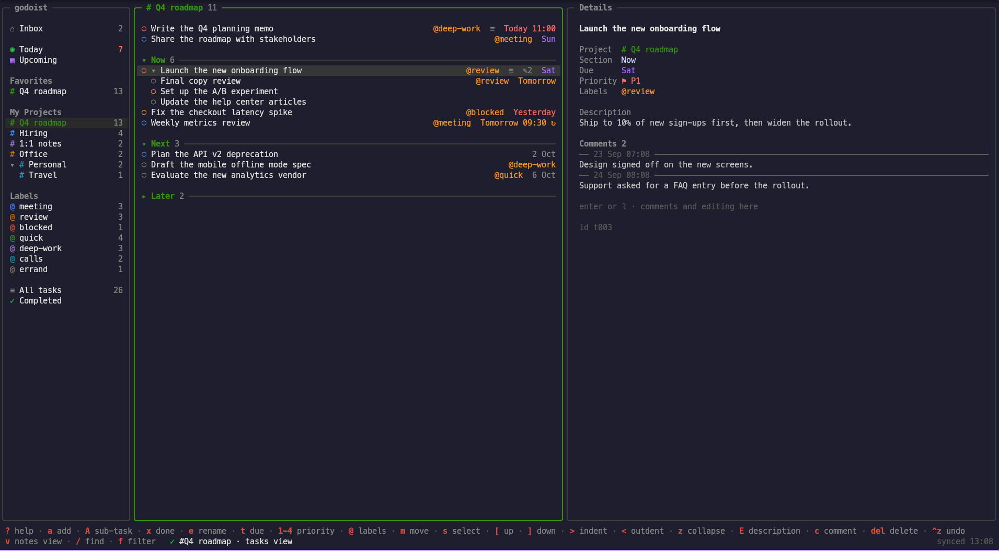

# godoist

godoist is a terminal program for [Todoist](https://todoist.com). It has a text user interface (TUI) with three panes and a command-line interface (CLI) for scripts. The program uses the Go language.

> This software was developed with the assistance of a LLM.



## Features

- Three panes: sidebar, task list, and details.
- Project colors from the Todoist palette. Light and dark terminal themes.
- Inbox, Today, Upcoming, Favorites, the project tree, labels, All tasks, and Completed, with task counts.
- Quick add with Todoist natural-language parsing: dates, `#project`, `/section`, `@label`, `p1`–`p4`.
- A date dialog with a text field, a month calendar, and a time field.
- Sub-tasks, manual order, priorities, labels, moves, comments, descriptions, sections, and projects.
- Collapse and expand of sections, sub-tasks, and sub-projects.
- Multi-select with bulk actions.
- Notebook view per project, with a markdown reader and an inline markdown editor.
- Todoist filter queries and a find in the current view.
- Mouse support: click, double-click, right-click menus, drag to move, and the wheel.
- A local cache. The program starts from the cache and syncs in the background.
- CLI commands with aligned columns, TSV, or JSON output.

## Requirements

- Go 1.27 or later, to build the program. See [Install Go](#install-go).
- A Todoist account and its API token.
- A terminal with true color and mouse support. Most modern terminals have both.

## Installation

### Install Go

If you do not have Go, install it with the package manager of your system.

macOS ([Homebrew](https://brew.sh)):

```sh
brew install go
```

Debian and Ubuntu:

```sh
sudo apt install golang-go
```

Fedora, RHEL, and CentOS Stream:

```sh
sudo dnf install golang
```

Arch Linux and Manjaro:

```sh
sudo pacman -S go
```

openSUSE:

```sh
sudo zypper install go
```

Any Linux, with the official archive from [go.dev](https://go.dev/dl/) (use `arm64` in place of `amd64` on ARM):

```sh
curl -LO https://go.dev/dl/go1.27.1.linux-amd64.tar.gz
sudo rm -rf /usr/local/go
sudo tar -C /usr/local -xzf go1.27.1.linux-amd64.tar.gz
echo 'export PATH="$PATH:/usr/local/go/bin"' >> ~/.profile
```

Examine the version with `go version`. Some distributions have a Go version that is older than 1.27. Go 1.21 or later can download the necessary version itself. If `go install` fails because the version is too old, add `GOTOOLCHAIN=go1.27.1` before the command:

```sh
GOTOOLCHAIN=go1.27.1 go install github.com/biomassa/godoist/cmd/godoist@latest
```

### Install godoist

Each [release](https://github.com/biomassa/godoist/releases) has binaries for Linux and macOS (amd64 and arm64). You do not need Go for them. Download the archive for your system, then extract `godoist` to a directory in your `PATH`:

```sh
tar -xzf godoist_0.1.0_linux_amd64.tar.gz
install godoist_0.1.0_linux_amd64/godoist ~/.local/bin/
```

On macOS, a downloaded binary can get a quarantine flag. If macOS refuses to start it, remove the flag with `xattr -d com.apple.quarantine ~/.local/bin/godoist`.

Or install the latest release with Go:

```sh
go install github.com/biomassa/godoist/cmd/godoist@latest
```

Go puts the binary in `$(go env GOPATH)/bin`, usually `~/go/bin`. Make sure that this directory is in your `PATH`:

```sh
echo 'export PATH="$PATH:$(go env GOPATH)/bin"' >> ~/.profile
```

To build from the source:

```sh
git clone https://github.com/biomassa/godoist.git
cd godoist
go build -o godoist ./cmd/godoist
```

## Configuration

godoist needs your Todoist API token. Get it in Todoist: **Settings → Integrations → Developer**.

Give the token to godoist in one of these two ways:

1. Set the environment variable:

   ```sh
   export TODOIST_TOKEN=your-token
   ```

2. Save the token in the config file:

   ```sh
   godoist login
   ```

   This command asks for the token, makes sure that it works, and writes it to `~/.config/godoist/config.toml` with owner-only permissions.

The environment variable has priority over the config file.

godoist writes these files:

| File | Content |
|---|---|
| `~/.config/godoist/config.toml` | The API token (after `godoist login`). |
| `~/.cache/godoist/sync.json` | The local copy of your account (owner-only permissions). |
| `~/.cache/godoist/queue-*.json` | The task changes that wait for the network (owner-only permissions). |
| `~/.local/state/godoist/state.toml` | The expanded tasks of each overview. |

## TUI

Start the TUI:

```sh
godoist
```

Push `?` to see all keys. The first bottom line shows the keys for the pane that has the focus. You can click a key there to run it. The second bottom line shows the last operation and the sync state.

### Main keys

| Key | Action |
|---|---|
| `tab`, `h` / `l` | Go to the next or previous pane. |
| `j` / `k`, `g` / `G` | Move down or up, go to the top or the bottom. |
| `enter` | Open the project, or open the details. |
| `a` | Add a task. The dialog has a name, which Todoist parses, and a description. |
| `x` or `space` | Complete the task. `ctrl+z` undoes the last completion of a one-time task. |
| `e` | Edit the name and the description. Todoist parses dates, `#project`, `@label`, and `p1`–`p4` in the name. |
| `E` | Edit the description in the markdown editor (see [Notebook view](#notebook-view)). |
| `t` | Open the date dialog. |
| `o` | Open the first link of the task in the browser: a link of the name, or else a link of the description. |
| `1`–`4` | Set the priority. |
| `@` | Select labels. |
| `m` | Move the task to a project or a section. |
| `c` | Add a comment in the markdown editor. godoist adds the comment when you close the editor. |
| `A` | Add a sub-task to the task under the cursor. The dialog has a name and a description. |
| `>` / `<` | Indent the task under the task above it, or outdent it one level. |
| `[` / `]` | Move the task up or down. At the edge of a section, the task goes into the next section. |
| `z` | Collapse or expand the sub-tasks. On a section header, collapse or expand the section. |
| `s` / `S` | Select the task, or select all tasks from the last selected task to the cursor. |
| `Delete` / `Backspace` | Delete the task. godoist asks first, because a deletion cannot be undone. |
| `v` | Change the project between task view and notebook view. |
| `/` | Find in the current view. |
| `f` | Run a Todoist filter query. Plain words search the task names. |
| `esc` | Clear the find or the filter. |
| `r` | Sync now. |
| `q` | Quit. godoist waits until Todoist has all changes. |

### Task dialog

The `a`, `e`, and `A` keys open a dialog with two fields: the name and the description. The dialog uses 2/3 of the terminal height. A long description scrolls.

| Key | Action |
|---|---|
| `tab` / `shift+tab` | Go to the other field. A click on a field also goes to it. |
| `enter` | In the name: save. In the description: start a new line. |
| `ctrl+enter` or `ctrl+s` | Save from the two fields. For `ctrl+enter`, the terminal must send it as a separate key (for example kitty, WezTerm, foot, or Ghostty). macOS Terminal sends it as `enter`, so use `ctrl+s` there. |
| `esc` | Close the dialog without a save. |

Todoist parses the name as in quick add. godoist saves the description as typed. In notebook view, the dialog has only the name.

### Descriptions and comments

The details pane shows task descriptions and comments as formatted markdown, as the notebook reader does. A description or a comment can have checkboxes (`- [ ] item`). When the details pane has the focus, `tab` and `shift+tab` move between the checkboxes. `space` or a click changes a checkbox and saves it. With no checkbox selected, `space` completes the task.

Descriptions and comments use the same markdown editor as notes, with the live preview. The editor saves a description or a changed comment by itself one second after you stop typing. It adds a new comment when you close the editor. It does not save an empty comment. `esc`, `ctrl+enter`, or `ctrl+s` closes the editor, and `ctrl+e` opens the text in `$EDITOR`.

### Notebook view

Push `v` in a project to show it as a notebook. godoist writes the line `godoist:notes` at the end of the project description in Todoist. Thus the notebook view is the same on all your computers. Todoist shows this line in the project description. Push `v` again to go back to the task view and remove the line. The right pane shows the note under the cursor as formatted markdown. Headings show as colored bars: red, yellow, green, blue, orange, and purple for levels 1 to 6. The pane also shows lists, `☐` / `☑` checkboxes, links (terminal hyperlinks), and code with syntax colors.

- In a note with checkboxes, `tab` and `shift+tab` move between the checkboxes, and `space` or a click changes a checkbox.
- To edit the note, push `enter` in the reader, push `E`, or double-click the text. The inline editor opens in the same pane. The editor shows a live preview: each line shows formatted markdown, as the reader does, except the line with the cursor, which shows its source. A fenced code block or a table shows as source while the cursor is in it. While the find box is open, all lines show as source. It saves by itself one second after you stop typing, and when you leave it with `esc`, `ctrl+enter`, or `ctrl+s`. The pane title shows `saved`, `saving…`, or `unsaved`.
- Editor keys: `ctrl+b` bold, `ctrl+i` italic, `ctrl+k` link, `ctrl+t` checkbox, `ctrl+z` / `ctrl+y` undo and redo, `alt+←` / `alt+→` word moves, `alt+backspace` deletes a word. `enter` on a list item starts the next item, and `enter` on an empty item ends the list.
- Selection: `shift` with the arrows, `home`, or `end` selects text. `alt+shift+←` / `alt+shift+→` (or `ctrl+shift`) select word by word, and `ctrl+a` selects all. A mouse drag also selects (`shift`+drag stays the terminal selection). Typed text, `enter`, `backspace`, `delete`, or a paste replaces the selection. `ctrl+c` copies and `ctrl+x` cuts to the system clipboard, and `ctrl+v` pastes from it. The terminal sends the clipboard (OSC 52), so kitty can ask you to allow the paste the first time. The task dialog fields have the same keys.
- `ctrl+f` opens a find box at the top of the editor, with a replace field and the option **match case**. The box highlights all matches. `enter` goes to the next match and `shift+enter` to the previous match. `ctrl+r` replaces the current match and `ctrl+a` replaces all matches. They use the replace field as it is. Thus an empty field removes the matches (for example, all `**`). `tab` moves between the fields, `space` changes **match case**, and `esc` closes the box.

### Date dialog

The `t` key opens a dialog with three parts: a text field, a month calendar, and a time field.

1. Type a date in the text field, for example `fri 9am` or `every mon`. Type `no date` to remove the date.
2. Push `tab` to go to the calendar. Todoist parses the changed text one time, and the calendar shows the result.
3. In the calendar, use the arrow keys, `PgUp` / `PgDn`, `Home`, or the quick picks `1`–`5`.
4. Push `enter`. godoist saves the input that you changed last.

For a recurring task, a date from the calendar asks a question. Push `o` to move only this occurrence and keep the repeat. Push `r` to replace the repeat with the date.

### Projects

These keys work in the sidebar, with the cursor on a project:

| Key | Action |
|---|---|
| `A` | Add a project. Type the name, then select a color. The color picker can make the new project a sub-project of the project under the cursor. |
| `e` | Rename the project. |
| `C` | Change the color. |
| `*` | Add the project to Favorites, or remove it. |
| `[` / `]` | Move the project up or down among its siblings. |
| `>` / `<` | Make the project a sub-project of the project above it, or move it one level up. |
| `m` | Move the project under another project, or to the top level. |
| `z` | Collapse or expand the sub-projects. |
| `Delete` / `Backspace` | Delete or archive the project. A dialog asks which. |

You can also drag a project onto another project to make it a sub-project, or onto **My Projects** to make it a top-level project. A project moves with its sub-projects. You cannot change the Inbox. The Todoist free plan limits the number of projects. If Todoist refuses a new project, godoist shows the message from Todoist.

### Multi-select

Push `s` to select a task, or `S` to select a range. `ctrl`+click and `shift`+click also select. The title shows the number of selected tasks. With tasks selected, these keys act on all of them: `x`, `t`, `1`–`4`, `m`, `@`, and `Delete`. The selection stays after a change, so you can do more changes. `esc` clears the selection. One `ctrl+z` opens again all one-time tasks of a bulk completion.

In the label picker for several tasks, `[x]` shows a label that all tasks have, `[~]` a label that some tasks have, and `[ ]` a label that no task has. `space` changes the state. godoist changes only the labels that you changed.

### Labels

The **Labels** group in the sidebar shows your labels. Select a label to see its tasks, grouped by project and section, as in **All tasks**. These keys work with the cursor on a label:

| Key | Action |
|---|---|
| `A` | Add a label. |
| `e` | Rename the label. Its tasks get the new name. |
| `C` | Change the color. |
| `*` | Mark the label as a favorite, or remove the mark. |
| `[` / `]` | Move the label up or down. |
| `Delete` / `Backspace` | Delete the label. The label goes away from its tasks, and the tasks stay. |

### Completed

The **Completed** item shows the tasks that you completed in the last 30 days, grouped by project. Push `x` to open a task again.

### Sub-tasks in Today, Upcoming, All tasks, labels, and filters

These views show sub-tasks under their parent tasks. At first, a task with sub-tasks shows collapsed. Push `z`, or click `▸`, to expand it. If only a sub-task belongs to the view (for example, only the sub-task is due today), the parent comes into the view, gray and expanded. A parent shows one time, in the group of its earliest date. Each view keeps its own expanded tasks in `~/.local/state/godoist/state.toml`.

### All tasks

The **All tasks** item shows all tasks, grouped by project and then by section. In each project, the tasks without a section come first, then each section in its order, under an indented header. In each group, the tasks with a due date come first, sorted by the date. In this view, `[` and `]` move only tasks without a due date.

### Confirmations

A deletion opens a dialog with buttons. The action button is selected when the dialog opens. Use the arrow keys, `tab`, or `h` / `l` to select a button, then push `enter`. You can also push the key of a button, or click it. `esc` closes the dialog.

### Sections

These keys work in a project:

| Key | Action |
|---|---|
| `A` | Add a section after the section under the cursor. |
| `e` | Rename the section under the cursor. |
| `[` / `]` | Move the section up or down. |
| `z` | Collapse or expand the section. |
| `Delete` / `Backspace` | Delete the section and its tasks. godoist asks first. |

### Mouse

- Click to select. Click the `○` circle to complete a task.
- Double-click a task to edit it.
- Links in task names are terminal hyperlinks. Open them with the link key of your terminal, for example `ctrl+shift+click` in kitty or `cmd+click` on macOS.
- Right-click a task, a section header, a sidebar project, or a label to open a menu.
- Click a `▾` or `▸` marker to collapse or expand.
- `ctrl`+click selects a task, and `shift`+click selects a range.
- Drag a task to a sidebar project or a section header to move it.
- Use the wheel to scroll.

To select text in the terminal, hold `Shift` while you drag.

## CLI

Use the CLI in scripts. On a terminal, the output has aligned columns. In a pipe, the output is TSV. Add `--json` to get JSON.

| Command | Action |
|---|---|
| `godoist ls` | List the active tasks. |
| `godoist ls -p <project>` | List the tasks of one project. |
| `godoist ls -f "<filter>"` | List the tasks that match a Todoist filter. |
| `godoist add "<text>"` | Add a task with natural-language parsing. In a terminal, it prints the name, project, due date, and task ID. In a pipe, it prints only the task ID. |
| `godoist add -p <project> "<text>"` | Add a task to a project. |
| `godoist done <id>...` | Complete tasks. |
| `godoist reopen <id>...` | Open completed tasks again. |
| `godoist rm <id>...` | Delete tasks. |
| `godoist projects` | List the projects. |
| `godoist login` | Save the API token. |
| `godoist version` | Print the version (also `godoist --version`). |

Examples:

```sh
godoist ls -f "today | overdue"
godoist add "Buy cables tomorrow 10am #work p2 @errand"
godoist ls -f "today" --json | jq -r '.[].content'
godoist ls -p work | cut -f1 | xargs godoist done
```

## Sync

godoist keeps a local copy of your account and uses the Todoist Sync API. It syncs:

- when it starts,
- after each change,
- every 60 seconds,
- when the terminal gets the focus,
- when you push `r`.

Each change goes to Todoist at once.

### Offline

If the computer is offline, godoist starts with the local copy, and the bottom line shows `offline`. Task changes go into a queue on your computer, and the list shows them at once:

- Add, complete, reopen, edit the name or the description, date, priority, move, labels, order, sub-tasks, comments, and delete.
- Todoist parses dates, `#project`, and `@label` in a name when the network is back. Until then, the task shows the typed text with `⏳`.
- The bottom line shows `offline · 3 changes waiting`.

At the next sync with network, godoist sends the queue to Todoist in order. If Todoist refuses a change (for example, because another device deleted the task), the status line shows it. Project, section, and label changes need the network: offline, they show `offline · try again later`. If changes wait when you quit, godoist asks first. The queue stays on disk, and godoist sends it at the next start.

The CLI does not use the queue: offline, its commands fail.

## Versions

godoist uses [Semantic Versioning](https://semver.org). Before version 1.0.0, a minor version (0.2.0) can change keys, commands, and file formats. [CHANGELOG.md](CHANGELOG.md) lists the changes of each version. `godoist --version` and the help screen (`?`) show the version.

To make a release:

1. Move the notes under `## [Unreleased]` in CHANGELOG.md to a new section `## [0.2.0] - YYYY-MM-DD`, and update the links at the end of the file.
2. Commit the change on `main`.
3. Run `scripts/release.sh --dry-run v0.2.0`, and examine `dist/notes.md`.
4. Run `scripts/release.sh v0.2.0`. The script runs the tests, builds the binaries, pushes the tag, and publishes the GitHub release with the `gh` CLI.
